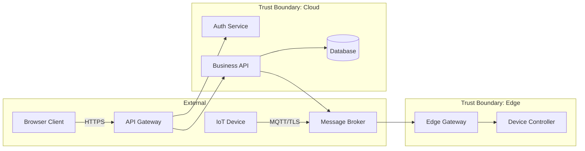

# Unitone Sentinel — Threat Modeling Module: Architecture Document

## 1. System Context

Unitone Sentinel is a security automation platform that integrates threat modeling into the development lifecycle. The Threat Modeling module allows developers to submit a GitHub repository URL or design document and receive an automated threat model with structured threats, data flow diagrams, and actionable mitigations.

```
                    ┌────────────────┐
                    │   Developer    │
                    │   (Browser)    │
                    └───────┬────────┘
                            │ HTTPS
                            ▼
                    ┌────────────────┐
                    │   Next.js 16   │
                    │   App Router   │
                    │  ┌──────────┐  │
                    │  │ Frontend │  │
                    │  │  React   │  │
                    │  └────┬─────┘  │
                    │       │        │
                    │  ┌────┴─────┐  │
                    │  │ API Route│  │
                    │  │ Handlers │  │
                    │  └────┬─────┘  │
                    └───────┼────────┘
                            │
              ┌─────────────┼─────────────┐
              │             │             │
              ▼             ▼             ▼
       ┌────────────┐ ┌──────────┐ ┌──────────┐
       │  GitHub    │ │ Claude   │ │ SQLite   │
       │  API      │ │ API      │ │ Database │
       │  (Octokit)│ │ (LLM)   │ │          │
       └────────────┘ └──────────┘ └──────────┘
```

## 2. Component Architecture

### 2.1 Frontend Layer

The frontend is a Next.js 16 App Router application using React 19, Tailwind CSS 4, and shadcn/ui components.

```
app/
├── threat-modeling/
│   └── page.tsx                    ← Main threat modeling UI
│                                     (Sessions List, Processing, Detail View)
components/unitone/
├── app-sidebar.tsx                 ← Navigation sidebar
├── code-diff.tsx                   ← Before/after code comparison
├── mermaid-diagram.tsx             ← NEW: Dynamic Mermaid DFD renderer
├── apply-fix-button.tsx            ← NEW: Apply Fix with PR creation
└── threat-status-badge.tsx         ← NEW: Reactive status badge
```

**State Management:** React useState + useEffect. No external state library needed — the session detail view fetches from API and manages local state. Optimistic updates on "Apply Fix" actions.

**Data Fetching Pattern:**
- Sessions list: `GET /api/threat-model/sessions` on mount
- Session detail: `GET /api/threat-model/sessions/:id` on selection
- Analysis trigger: `POST /api/threat-model/sessions/:id/analyze` then poll status
- Apply fix: `POST /api/threat-model/threats/:id/apply-fix` → optimistic UI update

### 2.2 API Layer

Next.js Route Handlers serve as the API layer. No separate backend server.

```
app/api/threat-model/
├── sessions/
│   ├── route.ts
│   │   ├── GET  → List all sessions (with stats)
│   │   └── POST → Create new session
│   │             Body: { name, source, sourceRef, framework }
│   │             Returns: { id, status: "Processing" }
│   │
│   └── [id]/
│       ├── route.ts
│       │   ├── GET   → Full session with threats, DFD, insights
│       │   └── PATCH → Update session (status, name)
│       │
│       └── analyze/
│           └── route.ts
│               └── POST → Trigger analysis pipeline
│                          Kicks off: clone → analyze → generate → persist
│                          Returns: { status: "Processing" }
│
└── threats/
    └── [id]/
        ├── route.ts
        │   └── PATCH → Update threat (status, severity)
        │
        └── apply-fix/
            └── route.ts
                └── POST → Apply code fix
                           Body: { mitigationId }
                           Action: branch → commit fix → open PR
                           Returns: { prUrl, branch, commitSha }
                           Side effect: threat.status → "Mitigated"
```

### 2.3 Backend Services Layer

```
lib/threat-engine/
├── repo-analyzer.ts      ← Clone + inventory + architecture extraction
├── threat-generator.ts   ← LLM-powered STRIDE/OWASP threat generation
├── dfd-generator.ts      ← Architecture → Mermaid DFD conversion
├── insight-engine.ts     ← Quality metrics computation
├── fix-generator.ts      ← Code-level fix generation via LLM
└── git-service.ts        ← GitHub operations (clone, branch, PR)
```

#### 2.3.1 Repo Analyzer (`repo-analyzer.ts`)

**Responsibility:** Clone a GitHub repo and extract structured architecture information.

```
Input:  GitHub URL (e.g., "https://github.com/org/repo")
Output: RepoAnalysis object

Pipeline:
  1. git clone --depth=1 → /tmp/threat-model-{sessionId}/
  2. Walk file tree → categorize by language/framework
  3. Read key files:
     - package.json / requirements.txt / go.mod → dependencies
     - Dockerfile / docker-compose.yml → services
     - *.tf / *.yaml (CloudFormation) → infrastructure
     - Route files / controller files → API surface
     - Config files → security patterns (or anti-patterns)
  4. Pattern matching for security signals:
     - Regex: hardcoded secrets (API keys, passwords in source)
     - Regex: SQL string concatenation
     - Regex: eval() / exec() usage
     - Regex: missing HTTPS / TLS configuration
     - Presence/absence: auth middleware, CORS config, rate limiting
  5. Build component graph:
     - Identify services, databases, queues, gateways
     - Map data flows between components
     - Identify trust boundaries (external/internal/edge)
  6. Cleanup: rm -rf temp directory
```

**File size limits:** Skip binary files. Cap file reads at 50KB per file. Max 500 files analyzed.

#### 2.3.2 Threat Generator (`threat-generator.ts`)

**Responsibility:** Take architecture analysis and produce structured threats.

```
Input:  RepoAnalysis + framework selection (STRIDE | OWASP)
Output: Threat[] array

Pipeline:
  1. Construct LLM prompt with:
     - System: Security Engineer persona + threat grammar rules
     - User: Architecture summary + security findings + framework
  2. Call Claude API with structured output (JSON mode)
  3. Parse response into Threat[] matching data model
  4. Validate: each threat has all required fields
  5. Deduplicate: merge similar threats
  6. Rank: sort by severity (Critical → Low)
```

**LLM Prompt Structure:**
```
System: You are a Principal Security Review Engineer...
        [threat grammar template]
        [STRIDE/OWASP category definitions]
        [output JSON schema]

User:   Repository: {url}
        Architecture: {components, dataFlows, trustBoundaries}
        Security Findings: {patterns found in code}
        Framework: STRIDE

        Generate a comprehensive threat model.
        For each security finding, map it to a specific threat.
        For each component boundary crossing, assess threats.
        Output as JSON array of Threat objects.
```

**Token budget:** ~4000 input tokens for architecture, ~8000 output tokens for threats.

#### 2.3.3 DFD Generator (`dfd-generator.ts`)

**Responsibility:** Convert architecture analysis into a Mermaid.js data flow diagram.

```
Input:  RepoAnalysis.components + dataFlows + trustBoundaries
Output: Mermaid diagram string

Pipeline:
  1. Group components by trust boundary
  2. Generate Mermaid subgraph for each boundary
  3. Add edges for data flows with protocol labels
  4. Style: external entities (blue), processes (green), data stores (orange)
```

**Example output:**


#### 2.3.4 Fix Generator (`fix-generator.ts`)

**Responsibility:** Generate code-level mitigations for identified threats.

```
Input:  Threat + source file content from cloned repo
Output: Mitigation with code diff (original → fixed)

Pipeline:
  1. Read the identified vulnerable file from the cloned repo
  2. Construct LLM prompt:
     - Threat description + STRIDE category
     - Full file content (or relevant section)
     - Instruction: generate minimal, correct fix
  3. Parse response: extract original lines + fixed lines
  4. Validate fix:
     - Ensure original lines exist in source file
     - Basic syntax check (if language parser available)
  5. Return Mitigation object with codeSnippet
```

**For document sources:** Skip code generation, produce only prose mitigation.

#### 2.3.5 Git Service (`git-service.ts`)

**Responsibility:** Perform Git operations for cloning repos and applying fixes.

```
Clone Flow:
  1. simple-git.clone(url, { depth: 1 }) → temp directory
  2. Return path to cloned repo

Apply Fix Flow:
  1. Create branch: fix/threat-{threatId}
  2. Read target file, apply code change
  3. git add + git commit
  4. git push (via GitHub token)
  5. Octokit: create PR against default branch
  6. Return PR URL

Required: GITHUB_TOKEN with repo + pull_request scopes
```

#### 2.3.6 Insight Engine (`insight-engine.ts`)

**Responsibility:** Compute quality metrics from the threat list.

```
Input:  Threat[] array
Output: InsightMetrics

Metrics computed:
  - STRIDE coverage: how many of 6 categories have threats
  - Severity distribution: count per severity level
  - Mitigation rate: % of threats with at least one mitigation
  - Threat density: threats per component
  - Trust boundary coverage: % of boundaries with associated threats
```

### 2.4 Data Layer

**SQLite** via `better-sqlite3` for persistence. Single file database at `./data/threats.db`.

```
┌─────────────┐     ┌──────────────┐     ┌──────────────┐
│  sessions   │────<│   threats    │────<│ mitigations  │
│             │     │              │     │              │
│ id (PK)     │     │ id (PK)      │     │ id (PK)      │
│ name        │     │ session_id   │     │ threat_id    │
│ source      │     │ title        │     │ description  │
│ source_ref  │     │ stride_cat   │     │ status       │
│ framework   │     │ severity     │     │ code_file    │
│ status      │     │ status       │     │ code_line    │
│ dfd_mermaid │     │ threat_src   │     │ code_original│
│ created_at  │     │ prerequisites│     │ code_fixed   │
│ updated_at  │     │ threat_action│     │ jira_key     │
└─────────────┘     │ threat_impact│     │ jira_summary │
                    │ impacted_ast │     │ jira_status  │
                    │ trust_bound  │     └──────────────┘
                    │ assumptions  │
                    │ related_cve  │
                    └──────────────┘
```

## 3. Request Flow: Generate Threat Model

```
Developer                Frontend              API                 Services
   │                        │                    │                      │
   │  1. Click "New Session"│                    │                      │
   │  Enter repo URL        │                    │                      │
   │  Click "Generate"      │                    │                      │
   │───────────────────────>│                    │                      │
   │                        │  2. POST /sessions │                      │
   │                        │───────────────────>│                      │
   │                        │  { id, status }    │                      │
   │                        │<───────────────────│                      │
   │                        │                    │                      │
   │                        │  3. POST /analyze  │                      │
   │                        │───────────────────>│  4. Clone repo       │
   │                        │                    │─────────────────────>│
   │  5. Show Processing    │                    │  5. Analyze arch     │
   │  animation             │                    │─────────────────────>│
   │<───────────────────────│                    │  6. Generate DFD     │
   │                        │                    │─────────────────────>│
   │                        │  7. Poll status    │  8. Generate threats │
   │                        │───────────────────>│─────────────────────>│
   │                        │  { status }        │  9. Generate fixes   │
   │                        │<───────────────────│─────────────────────>│
   │                        │                    │  10. Compute insights│
   │                        │                    │─────────────────────>│
   │                        │                    │  11. Persist to DB   │
   │                        │                    │─────────────────────>│
   │                        │  12. Poll → Ready  │                      │
   │                        │───────────────────>│                      │
   │                        │  { session data }  │                      │
   │                        │<───────────────────│                      │
   │  13. Show Detail View  │                    │                      │
   │  (DFD + Threats + KPI) │                    │                      │
   │<───────────────────────│                    │                      │
```

## 4. Request Flow: Apply Fix

```
Developer                Frontend              API                 GitHub
   │                        │                    │                      │
   │  1. Click threat row   │                    │                      │
   │───────────────────────>│                    │                      │
   │  2. See detail panel   │                    │                      │
   │  with code diff        │                    │                      │
   │<───────────────────────│                    │                      │
   │                        │                    │                      │
   │  3. Click "Apply Fix"  │                    │                      │
   │───────────────────────>│                    │                      │
   │                        │  4. POST /apply-fix│                      │
   │                        │───────────────────>│  5. Create branch    │
   │                        │                    │─────────────────────>│
   │                        │                    │  6. Commit fix       │
   │                        │                    │─────────────────────>│
   │                        │                    │  7. Open PR          │
   │                        │                    │─────────────────────>│
   │                        │                    │  { prUrl }           │
   │                        │                    │<─────────────────────│
   │                        │                    │  8. Update threat    │
   │                        │                    │  status → Mitigated  │
   │                        │  { prUrl, status } │                      │
   │                        │<───────────────────│                      │
   │  9. Show PR link       │                    │                      │
   │  Badge → "Mitigated"   │                    │                      │
   │<───────────────────────│                    │                      │
```

## 5. LLM Integration Architecture

### 5.1 Prompt Chain

The threat analysis uses a multi-step LLM prompt chain, not a single call:

```
Step 1: Architecture Understanding
  Input:  File tree + key file contents
  Output: Structured architecture summary (components, flows, boundaries)
  Model:  Claude Haiku (fast, cheap — this is classification work)

Step 2: Threat Generation
  Input:  Architecture summary + security findings + framework
  Output: Threat[] with full grammar statements
  Model:  Claude Sonnet (needs reasoning for threat identification)

Step 3: Fix Generation (per threat, if repo source)
  Input:  Threat + vulnerable file content
  Output: Code diff (original → fixed)
  Model:  Claude Sonnet (needs code generation quality)
```

### 5.2 Token Budget Estimates

| Step | Input Tokens | Output Tokens | Cost Estimate (per session) |
|------|-------------|---------------|----------------------------|
| Architecture Understanding | ~3,000 | ~2,000 | ~$0.01 |
| Threat Generation | ~5,000 | ~8,000 | ~$0.05 |
| Fix Generation (×8 threats) | ~2,000 each | ~1,000 each | ~$0.10 |
| **Total per session** | | | **~$0.16** |

### 5.3 Output Validation

All LLM outputs pass through a Zod schema validator before persisting:

```typescript
const ThreatSchema = z.object({
  title: z.string().min(10),
  stride: z.enum(["Spoofing", "Tampering", "Repudiation",
                   "Information Disclosure", "Denial of Service",
                   "Elevation of Privilege"]),
  severity: z.enum(["Critical", "High", "Medium", "Low"]),
  threatStatement: z.object({
    threatSource: z.string(),
    prerequisites: z.string(),
    threatAction: z.string(),
    threatImpact: z.string(),
    impactedAssets: z.array(z.string()),
  }),
  trustBoundary: z.string(),
  assumptions: z.array(z.string()),
  mitigations: z.array(MitigationSchema),
});
```

## 6. Security Considerations

### 6.1 Repo Cloning

- Clone into isolated temp directory with random name
- Enforce `--depth=1` (shallow clone) to limit disk usage
- Set a max repo size threshold (skip repos > 500MB)
- Clean up temp directory immediately after analysis
- Never persist cloned source code — only analysis results and targeted file snippets

### 6.2 GitHub Token

- Stored in environment variable, never exposed to frontend
- Requires minimum scopes: `repo` (read), `pull_requests` (write)
- Token is used server-side only in API route handlers
- Apply Fix requires write access — verify token permissions before attempting

### 6.3 LLM Prompt Injection

- Source code from repos is passed to the LLM — it could contain adversarial content
- Mitigation: structured output mode (JSON) limits deviation from expected schema
- Mitigation: Zod validation rejects malformed outputs
- Mitigation: do not execute any code suggested by the LLM

### 6.4 Data Privacy

- Session data (architecture summaries, threats) is stored locally in SQLite
- No source code is persisted — only file paths and targeted snippets
- Design documents uploaded are processed and then deleted from temp storage

## 7. Deployment Architecture

For this implementation phase, the application runs as a single Next.js process:

```
┌─────────────────────────────────────────┐
│  Single Next.js Process                 │
│                                         │
│  ┌─────────────┐  ┌─────────────────┐  │
│  │ SSR/React   │  │ API Routes      │  │
│  │ Frontend    │  │ (Route Handlers)│  │
│  └─────────────┘  └────────┬────────┘  │
│                            │            │
│  ┌─────────────────────────┴─────────┐  │
│  │ Backend Services                  │  │
│  │ (repo-analyzer, threat-generator, │  │
│  │  dfd-generator, fix-generator,    │  │
│  │  git-service, insight-engine)     │  │
│  └───────────────────────────────────┘  │
│                                         │
│  ┌───────────────────────────────────┐  │
│  │ SQLite DB (./data/threats.db)     │  │
│  └───────────────────────────────────┘  │
└─────────────────────────────────────────┘
         │              │
         ▼              ▼
   GitHub API      Claude API
```

Future scaling: extract backend services into a separate worker process with a job queue (Bull/Redis) for async analysis pipelines.

## 8. Error Handling Strategy

| Error Scenario | Handling |
|----------------|----------|
| GitHub clone fails (404, private repo) | Return error to frontend, show message in UI |
| GitHub rate limit | Retry with exponential backoff, max 3 retries |
| LLM API timeout | Retry once, then mark session as "Failed" |
| LLM returns malformed JSON | Retry with stricter prompt, fallback to partial results |
| Apply Fix fails (no write access) | Return error, suggest user fork the repo |
| SQLite write fails | Return 500, log error |
| Repo too large | Skip clone, return error suggesting shallow analysis |

## 9. Frontend Component Tree

```
ThreatModelingPage
├── AppSidebar
├── AppHeader
│   └── ProgressTracker (breadcrumb)
├── [view === "list"]
│   └── SessionsList
│       └── SessionCard (×N)
├── [view === "processing"]
│   └── ProcessingState (animated steps)
├── [view === "detail"]
│   └── SessionDetailView
│       ├── KPI Cards (Total, Critical, High, Medium, Mitigated)
│       └── Tabs
│           ├── "Threat List"
│           │   └── ThreatRow (×N, clickable)
│           ├── "Data Flow Diagram"
│           │   └── MermaidDiagram ← NEW (replaces static DFD)
│           └── "Insights"
│               ├── STRIDE Coverage
│               ├── Mitigation Rate
│               └── Category Breakdown
├── ThreatDetailPanel (slide-over)
│   ├── Threat Statement (AWS Grammar)
│   ├── Trust Boundary
│   ├── Assumptions
│   ├── Mitigations
│   │   ├── CodeDiff (if repo source)
│   │   ├── Prose Suggestion (if doc source)
│   │   └── ApplyFixButton ← NEW
│   └── Related CVE link
└── NewSessionDialog
    ├── Source Type Toggle
    ├── Repo URL / Doc Upload
    └── Framework Selector
```
